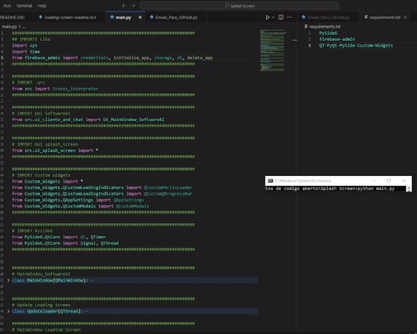

# Custom Loading Screen PySide6/Custom_Widgets For SoftwareAI

A modern desktop application with a custom loading screen developed using PySide6.



## 🚀 Features

- Animated loading screen with Perlin noise effect
- Smooth transition to main window
- Customizable progress indicators
- Dynamic color system
- Real-time loading message updates

## 📋 Prerequisites

- Python 3.8+
- PySide6
- QT-PyQt-PySide-Custom-Widgets
- Firebase Admin SDK
- Other dependencies listed in `requirements.txt`

## 🔧 Installation

1. Clone the repository:
```bash
git clone https://github.com/ualers/Loading-Screen-PySide6-QCustomPerlinLoader.git
```

2. Install dependencies:
```bash
pip install -r requirements.txt
```

3. Configure Firebase credentials:
- Add your Firebase configuration file to the root directory
- Update code references as needed

## 💻 Project Structure

```
loading-screen-project/
├── ui/
│   ├── splash_screen.ui
├── src/
│   ├── ui_cliente_and_chat.py
│   ├── ui_splash_screen.py
│   └── icones_interpreter.py
├── Qss/
│   ├── icons/_icons.qrc
├── JsonStyle/
│   └── style.json
└── main.py
```

## 🔍 Main Classes

### LoadingScreen
The main class responsible for the loading screen:
- Manages loading screen animation and styles
- Configures colors, sizes, and dynamic messages
- Controls transition to main window

```python
class LoadingScreen(QMainWindow):
    def __init__(self):
        # Loading screen initialization and configuration
        # ...
```

### Updateloader
Thread responsible for updating the loading screen:
- Manages loading messages
- Controls circle colors
- Emits signals for interface updates

```python
class Updateloader(QThread):
    messagesignal = Signal(str)
    circleColor1signal = Signal(str)
    circleColor2signal = Signal(str)
    finishedd = Signal()
    # ...
```

## 🎨 Customization

### Styles
Styles can be customized through the `JsonStyle/style.json` file:
```json
{
    "colors": {
        "primary": "#ff2e63",
        "secondary": "#082e63"
    },
    // ... other settings
}
```

### Loading Screen Settings
```python
self.myParentWidget.size = QSize(600, 600)
self.myParentWidget.color = QColor("white")
self.myParentWidget.fontFamily = "Ebrima"
self.myParentWidget.fontSize = 30
# ... other settings
```

## 🚀 Running the Project

Run the main file:
```bash
python main.py
```

## 📝 Contributing

1. Fork the project
2. Create your Feature Branch (`git checkout -b feature/AmazingFeature`)
3. Commit your changes (`git commit -m 'Add some AmazingFeature'`)
4. Push to the Branch (`git push origin feature/AmazingFeature`)
5. Open a Pull Request

## ✨ Acknowledgments
- KhamisiKibet For creating Qt-PySide-Custom-Widgets
- PySide6 for the excellent framework
- Qt Community for support
- Project contributors


Project Link: [https://github.com/ualers/Loading-Screen-PySide6-QCustomPerlinLoader](https://github.com/your-username/loading-screen-project)
